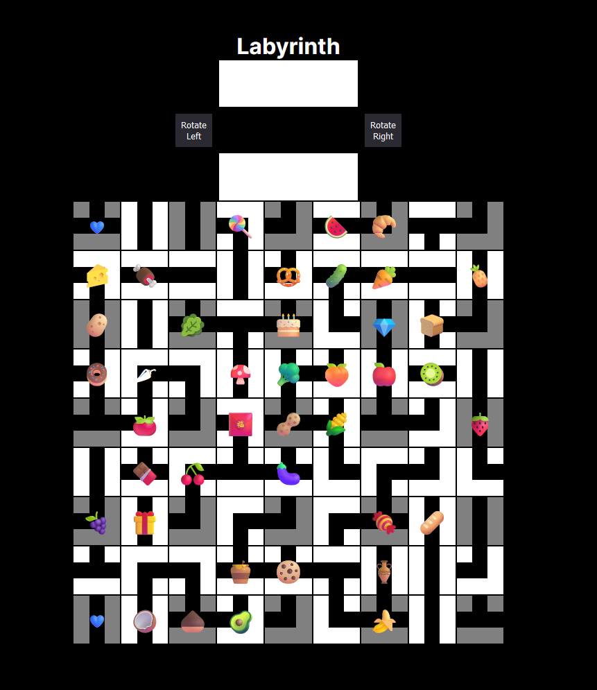

# Labyrinth

This is a re-creation of the classic game "Labyrinth" (also known as "The aMAZEing Labyrinth") in TypeScript.



## Repository structure

This repo uses a monorepo structure, with the following packages:

### Core packages

- `packages/labyrinth-game`: The core game logic. This is a pure TypeScript package, with no dependencies on any specific rendering engine.
- `packages/labyrinth-ai`: An AI player for the game. This package interacts with the game logic to make moves, and can be used to play the game against a computer opponent. **This package has yet to be implemented.**
- `packages/shared-utils`: A collection of utility functions and types that are shared between the other packages.

### Rendering apps

- `apps/labyrinth-web`: A web-based rendering of the game. This package uses next.js to provide server-side rendering, and is built with React. It also implements a simple api. This package is the main way to interact with the game.

### Configuration

Honestly this needs improvement, getting the mono-repo set up was a bit of a pain, and I'm not sure I've got it right yet. But here's what I've got so far:

- `packages/eslint-config`: A shared eslint configuration for all packages in this repo.
- `packages/tsconfig`: A shared tsconfig for all packages in this repo.

### Tooling

- `yarn workspaces`: This is the tool that allows managing the monorepo structure. It's what links the packages together, and allows for easy development across packages.
- `turbo`: This tool manages various scripts across the packages. Basically making sure things are built in the right order, and that the right scripts are run in the right packages. Pretty new to it so probably could be improved.

## Development

### Prerequisites

- Node.js (`>=v18.0.0`, I've been using `v20.11.0`)
  - I recommend using `nvm` or `n` to manage your Node.js versions.
- Yarn (`>=v1.22.0`, I've been using `v1.22.19`)

### Getting started

1. Clone the repository

```sh
git clone "git@github.com:ReidPritchard/a-maze-ing-labyrinth.git"
```

2. Install dependencies

```sh
yarn
```

3. Build the packages

```sh
yarn build
```

4. Start the web app

```sh
yarn dev
```

5. Open your browser to `http://localhost:3000` to see the web app!

At this point you can start making changes to the code and see them reflected in the web app.
It's pretty good at hot-reloading, but if you're not seeing changes, refresh the page.

## Contributing

If you'd like to contribute, please open an issue or a pull request. I'm happy to help you get set up with the codebase, and I'm open to any and all suggestions.

### Branching strategy

I'm using a simple branching strategy for this project. The `main` branch is the default branch, and is the most stable version of the code. All development work should be done on feature branches, and then merged into `main` via pull request.

As of now, I'm the only contributor, so I'm not enforcing this strategy, but I'm happy to help you get set up with it if you'd like to contribute.
